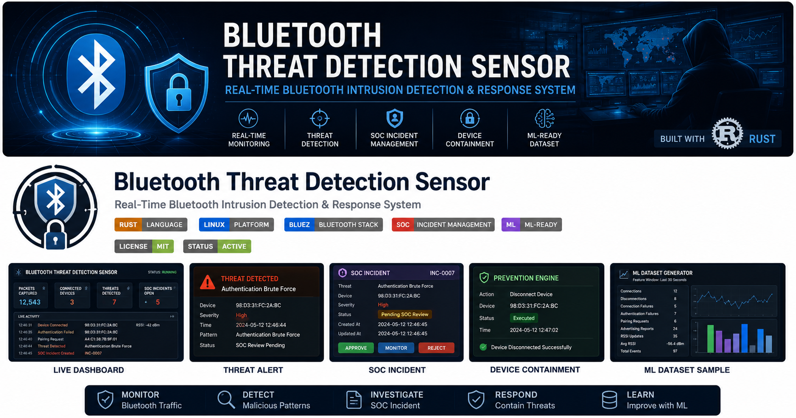

<p align="center">
  
</p>

<h1 align="center">🛡️ Bluetooth Threat Detection Sensor</h1>

<p align="center">
Real-Time Bluetooth Intrusion Detection & Response System (IDRS)
</p>

<p align="center">


</p>

---


# Bluetooth Threat Detection Sensor

A **real-time Bluetooth Intrusion Detection and Response System (IDRS)** developed in **Rust** for monitoring Bluetooth traffic, detecting suspicious behavior using signature-based detection, generating Security Operations Center (SOC) incidents, and supporting controlled device containment.

---

## Overview

The Bluetooth Threat Detection Sensor continuously monitors Bluetooth activity using **BlueZ btmon**, converts raw HCI events into structured security events, detects malicious behavioral patterns, generates alerts, creates SOC incidents, and prepares behavioral datasets for future Machine Learning-based anomaly detection.

The project follows a security-first workflow:

```
Bluetooth Traffic
        │
        ▼
     BlueZ btmon
        │
        ▼
 Packet Parsing Engine
        │
        ▼
 Bluetooth Events
        │
        ▼
 Signature Detection Engine
        │
        ▼
 Security Alert
        │
        ▼
 SOC Incident Manager
        │
        ▼
SOC Review & Validation
        │
        ▼
 Prevention Engine
        │
        ▼
 Disconnect / Block
```

---

# Features

### Real-Time Bluetooth Monitoring

- Live Bluetooth packet monitoring
- HCI event parsing
- Bluetooth device discovery
- RSSI monitoring
- Connection tracking
- Disconnection tracking
- Authentication monitoring
- Pairing monitoring

---

### Signature-Based Threat Detection

Implemented security signatures include:

- Advertising Flood
- Repeated Connection Failure
- Authentication Brute Force
- Pairing Request Flood
- Suspicious Connection Cycling
- Reconnection Flood
- Encryption Downgrade
- HCI Error Spike

Each signature supports:

- Configurable thresholds
- Sliding time windows
- Per-device detection
- Alert suppression
- False-positive reduction

---

### Security Operations Center (SOC)

Every detected threat becomes a SOC incident.

Supported incident states:

- Pending SOC Review
- Approved
- Monitoring
- Rejected
- False Positive

This separates **detection** from **active response**, reducing unnecessary device blocking.

---

### Prevention Engine

Active containment occurs **only after SOC approval**.

Current containment actions include:

- Bluetooth disconnect
- Bluetooth block

Safety mechanisms:

- Authorized test device validation
- Policy-based containment
- SOC approval required

---

### Live Dashboard

The real-time dashboard displays:

- Monitoring status
- Monitoring time
- Packets captured
- Connected devices
- Connection sessions
- Disconnections
- Devices discovered
- RSSI updates
- Authentication failures
- Pairing requests
- Threat count
- Latest detected threat
- Latest SOC incident
- SOC status

---

### Logging

The project automatically generates:

- CSV threat logs
- JSON security logs
- Threat reports
- Session statistics

---

### Machine Learning Dataset Generator

The sensor collects behavioral features every **30 seconds** for each Bluetooth device.

Current features include:

- Connections
- Disconnections
- Connection failures
- Authentication failures
- Pairing requests
- Advertising reports
- RSSI updates
- Average RSSI
- RSSI range
- Total events
- Connection/Disconnection ratio

These datasets are intended for future ML-based anomaly detection.

---

# Project Structure

```
bluetooth-threat-detection-sensor
│
├── src
│   ├── dashboard
│   ├── detector
│   ├── event_queue
│   ├── json_logger
│   ├── logger
│   ├── ml
│   ├── models
│   ├── parser
│   ├── patterns
│   ├── prevention
│   ├── reports
│   ├── signatures
│   ├── simulator
│   ├── soc
│   ├── statistics
│   └── main.rs
│
├── Cargo.toml
├── Cargo.lock
├── Architecture.txt
├── LICENSE
└── README.md
```

---

# Technology Stack

Programming Language

- Rust

Operating System

- Kali Linux
- Linux

Bluetooth Stack

- BlueZ
- btmon
- bluetoothctl

Runtime

- Tokio

Logging

- CSV
- JSON

Security

- Signature-Based Detection
- SOC Workflow
- Controlled Prevention

Future AI

- Behavioral Feature Engineering
- Machine Learning Dataset Generation

---

# Detection Workflow

```
Bluetooth Device
       │
       ▼
BlueZ btmon
       │
       ▼
Packet Builder
       │
       ▼
Bluetooth Events
       │
       ▼
Event Queue
       │
       ▼
Pattern Detector
       │
       ▼
Security Alert
       │
       ▼
SOC Incident
       │
       ▼
SOC Validation
       │
       ▼
Prevention Engine
```

---

# Machine Learning Pipeline

```
Bluetooth Traffic
        │
        ▼
Feature Extraction
        │
        ▼
Behavior Dataset
        │
        ▼
Model Training
        │
        ▼
Anomaly Detection
        │
        ▼
SOC Incident
```

---

# Installation

Clone the repository

```bash
git clone https://github.com/Roopashree1926/bluetooth-threat-detection-sensor.git
```

Move into the project

```bash
cd bluetooth-threat-detection-sensor
```

Build the project

```bash
cargo build
```

Run the sensor

```bash
sudo cargo run
```

---

# Example Dashboard

```
============================================================
        BLUETOOTH THREAT DETECTION SENSOR
============================================================
System Status   : RUNNING

Packets Captured            : 457
Currently Connected Devices : 1
Threats Detected            : 1

Latest Threat:
Suspicious Connection Cycling

Latest SOC Incident:
INC-0001

SOC Status:
APPROVED - DEVICE CONTAINED
============================================================
```

---

# Future Improvements

- Machine Learning anomaly detection
- Bluetooth Low Energy attack detection
- MITRE ATT&CK mapping
- Web-based SOC dashboard
- Email notifications
- SIEM integration
- Grafana dashboards
- Real-time visualization
- Threat intelligence integration

---

# Author

**Roopashree M**

Cybersecurity | Rust | Network Security | Bluetooth Security | Machine Learning

GitHub:
https://github.com/Roopashree1926

---

# License

This project is licensed under the **MIT License**.

See the LICENSE file for details.
